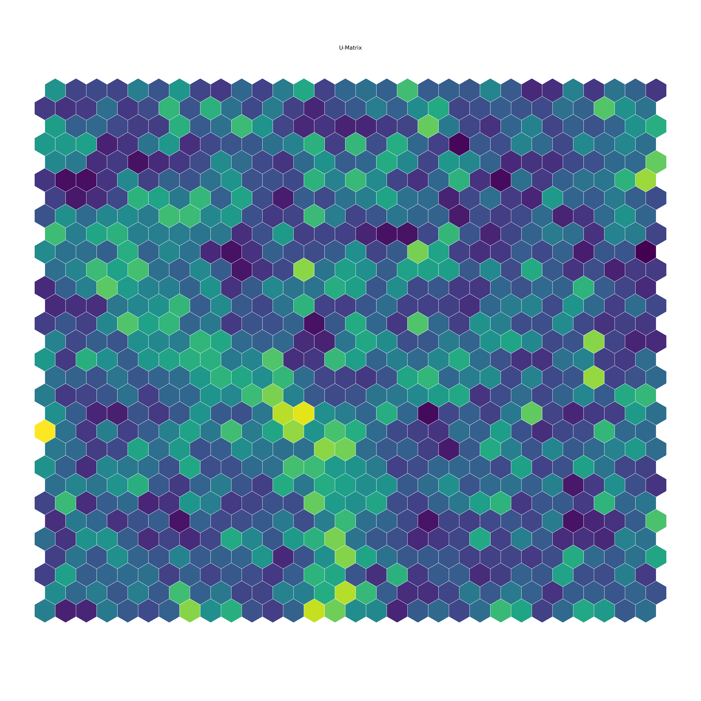
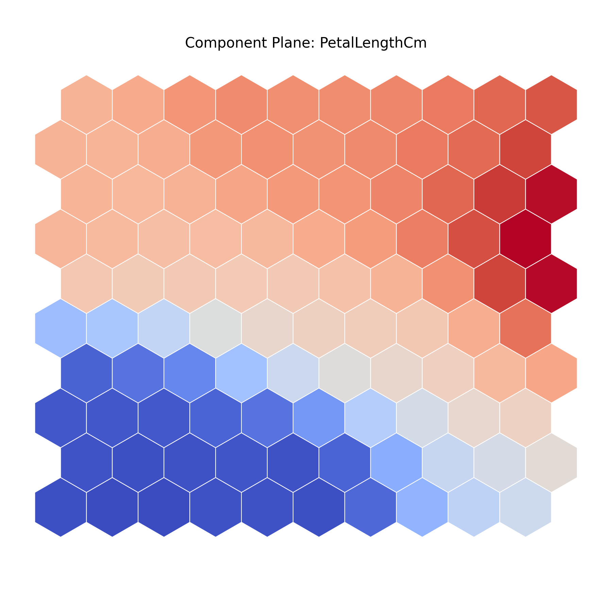
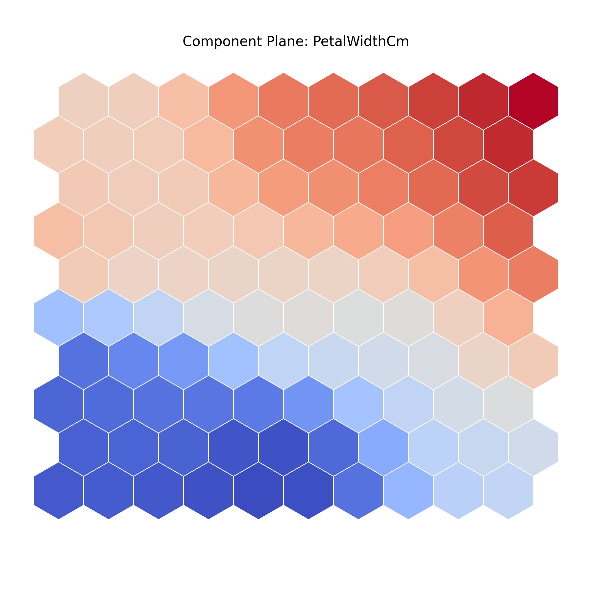
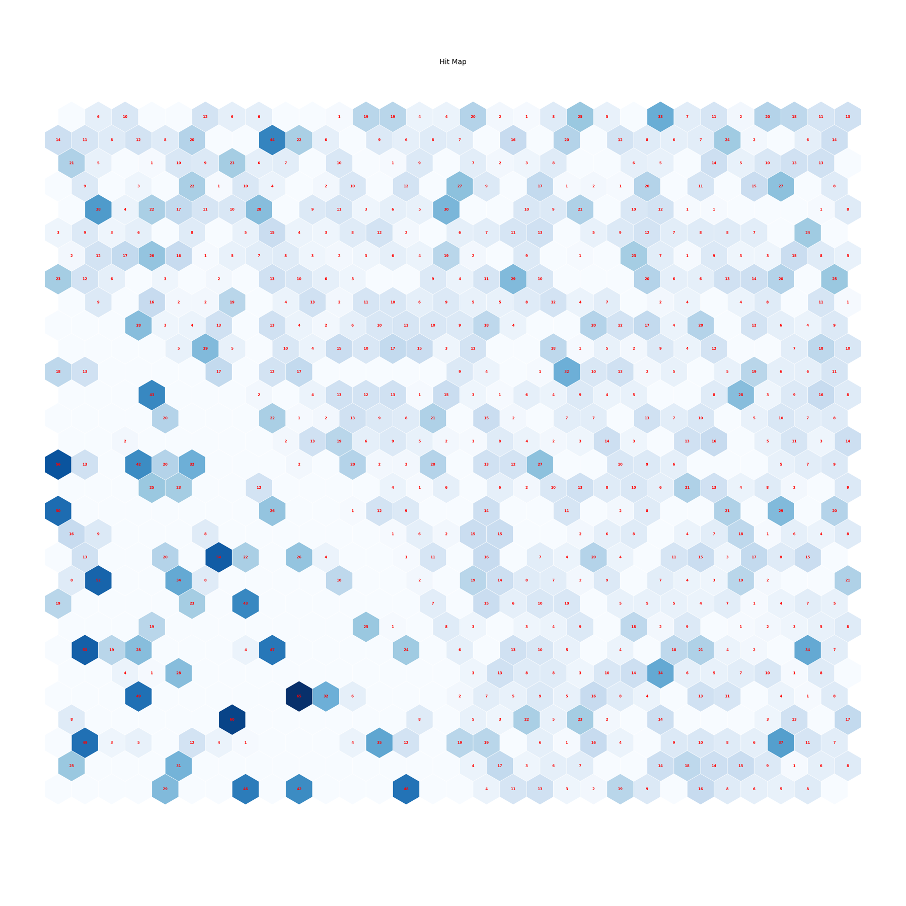
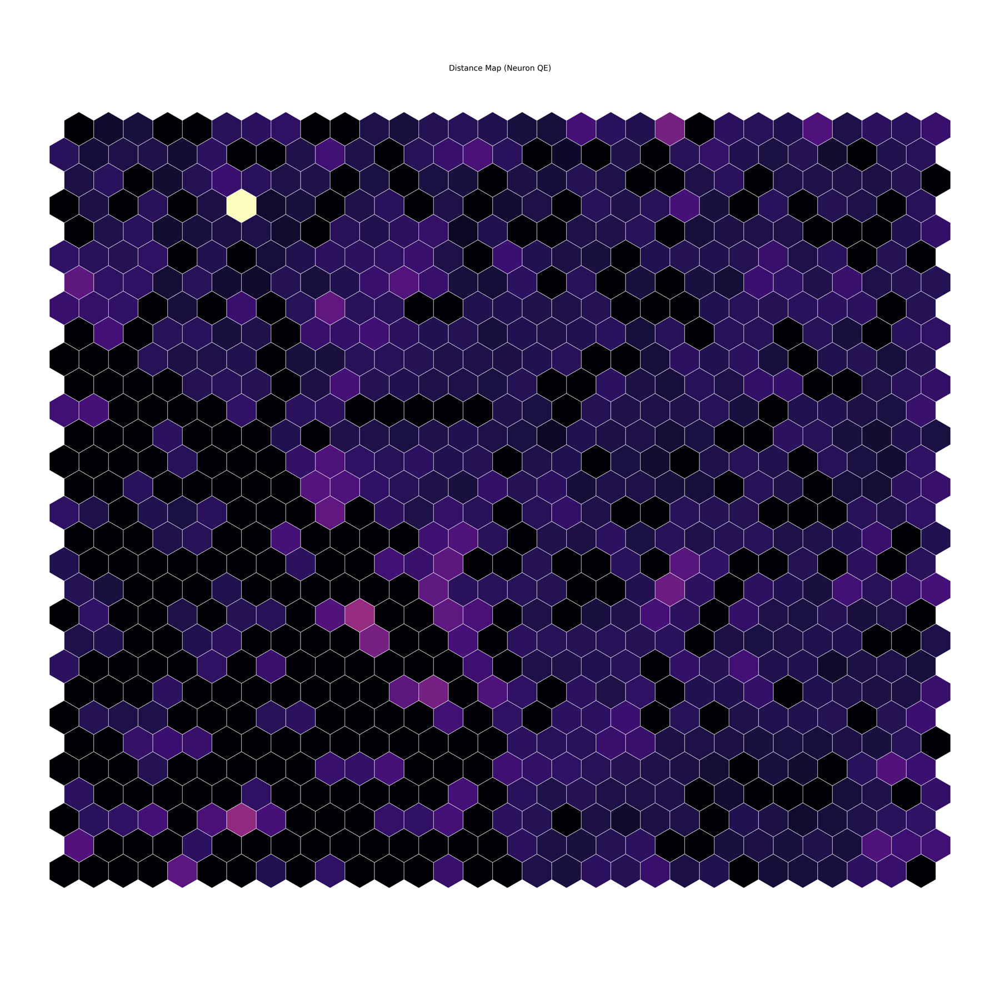
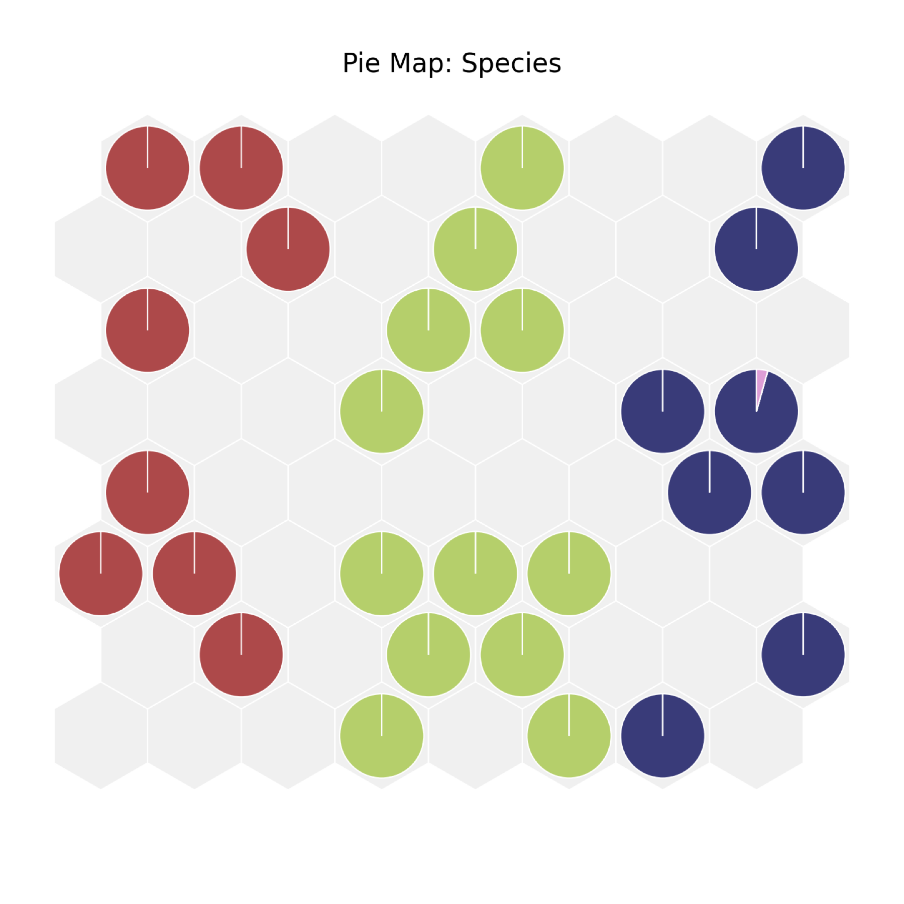
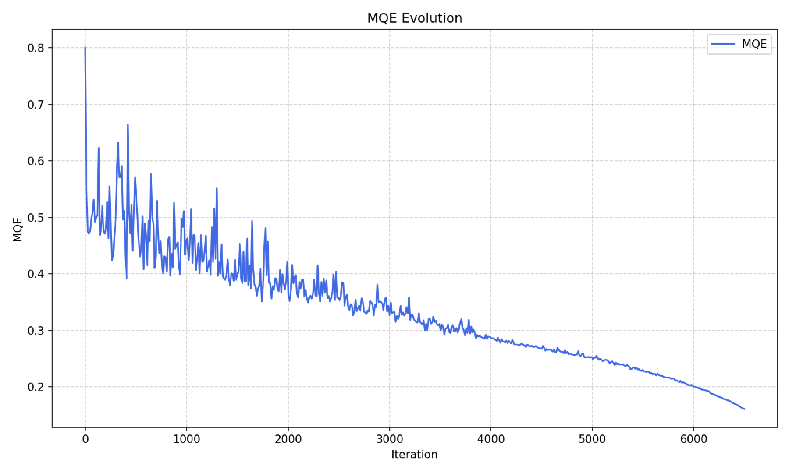
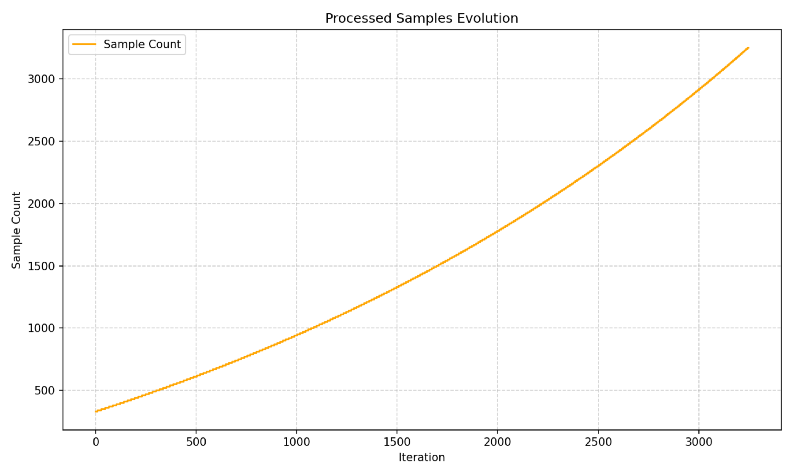
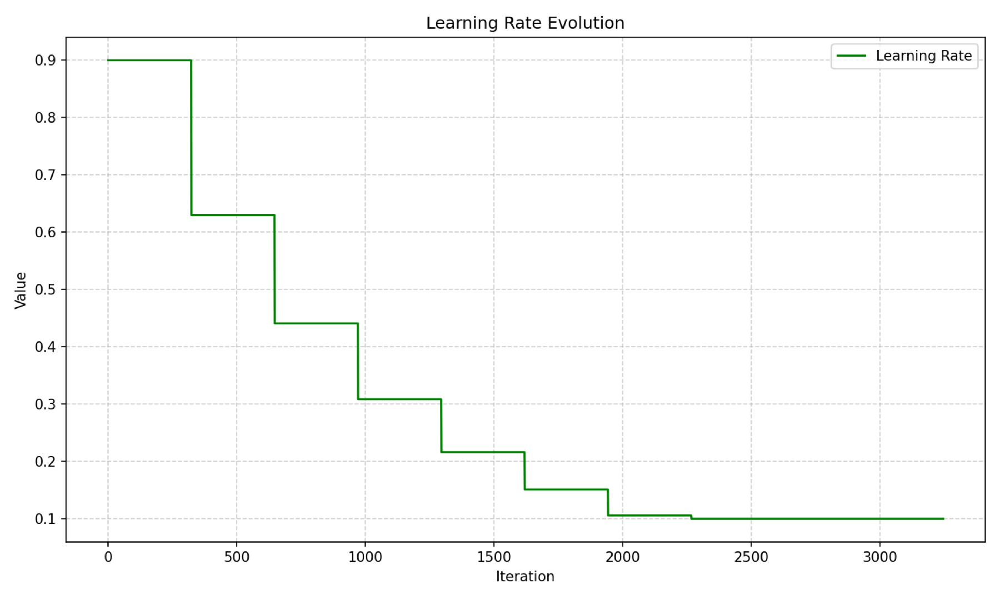

# SOM Output Visualization Examples

This document provides a gallery of the key visual outputs generated by the NexusSOM platform. These maps are the primary tools for understanding the structure of your data after it has been organized by the Self-Organizing Map.

*The following examples were generated using the standard Iris flower dataset.*

---

### 1. U-Matrix (Unified Distance Matrix)

**Purpose:** To identify cluster boundaries and data density.

The U-Matrix visualizes the distances between adjacent neurons. Darker areas ("valleys") represent coherent clusters where neurons are similar to each other. Lighter areas ("mountains" or "ridges") represent boundaries where adjacent neurons are very different, indicating a separation between clusters.

---

### 2. Component Planes

**Purpose:** To understand feature distribution and correlations.

A component plane is generated for each feature (dimension) in the dataset. The color of each neuron represents the value of its weight for that specific feature. By comparing planes, you can discover powerful correlations.

*   **Example Insight:** In the images below, notice how the bottom-left corner is dark (low value) on the `PetalLengthCm` plane and also dark on the `PetalWidthCm` plane. This indicates a strong positive correlation: data points in this cluster have both short petals and narrow petals.

| Component Plane for PetalLengthCm                                                                                 | Component Plane for PetalWidthCm                                                                       |
|-------------------------------------------------------------------------------------------------------------------|--------------------------------------------------------------------------------------------------------|
|  |  |
    
---

### 3. Hit Map

**Purpose:** To show the distribution and density of data samples on the map.

The Hit Map indicates how many data samples were mapped to each neuron (i.e., how many times each neuron was the Best Matching Unit). It helps identify which parts of the map are data-rich and which are empty ("inactive neurons").

---

### 4. Distance Map (Neuron Quantization Error)

**Purpose:** To identify areas of high error or diversity.

This map visualizes the average quantization error for each neuron. "Hot" (brighter) areas indicate neurons that represent a diverse or poorly-defined set of data points. This can point to outliers or regions with high internal variance within a cluster.

---

### 5. Pie Map (for Categorical Features)

**Purpose:** To visualize the distribution of categorical data across the map.

For categorical features (like `Species` in the Iris dataset), this map places a pie chart on each neuron. The chart shows the proportional breakdown of categories for the data samples mapped to that neuron. It's a powerful tool for understanding how discrete labels align with the discovered clusters.

---

### 6. Training Process Graphs

**Purpose:** To diagnose and understand the SOM's learning dynamics.

These plots are generated for every run and provide crucial insight into how the training process unfolded. They help verify if the SOM converged correctly and how its key parameters changed over time.

#### MQE Evolution

This is the most important training graph. It shows the Mean Quantization Error (MQE) at different points during training. A healthy curve should show a clear downward trend, eventually stabilizing (converging) at a low value.

#### Parameter Evolution

These graphs visualize how the core training parameters—**Learning Rate** and **Neighborhood Radius**—decayed over the training iterations. This is useful for confirming that the chosen decay functions (`lr_decay_type`, `radius_decay_type`) behave as expected.

| Growth Curves                                  | Decay Curves                                 |
|------------------------------------------------|----------------------------------------------|
|  |  |
